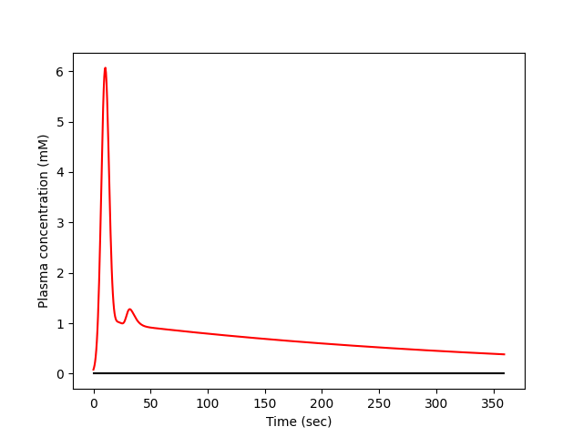
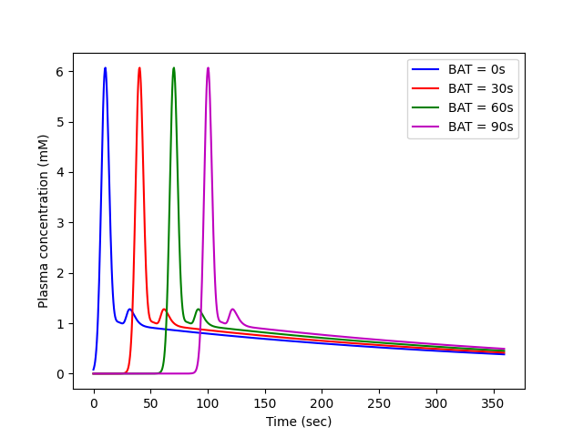

<!--
 DO NOT EDIT.
 THIS FILE WAS AUTOMATICALLY GENERATED BY mkdocs-gallery.
 TO MAKE CHANGES, EDIT THE SOURCE PYTHON FILE:
 "temp_dir/osipi/docs/examples/aif/plot_dummy.py"
 LINE NUMBERS ARE GIVEN BELOW.
-->

!!! note

    Click [here](#download_links)
    to download the full example code


==============
A dummy script
==============

Dummy script to illustrate structure of examples folder

<!-- GENERATED FROM PYTHON SOURCE LINES 8-11 -->

```{.python }

import matplotlib.pyplot as plt

```


<!-- GENERATED FROM PYTHON SOURCE LINES 12-13 -->

Import necessary packages

<!-- GENERATED FROM PYTHON SOURCE LINES 13-16 -->

```{.python }
import numpy as np
import osipi

```


<!-- GENERATED FROM PYTHON SOURCE LINES 17-18 -->

Generate synthetic AIF with default settings and plot the result.

<!-- GENERATED FROM PYTHON SOURCE LINES 18-33 -->

```{.python }

# Define time points in units of seconds - in this case we use a time
# resolution of 0.5 sec and a total duration of 6 minutes.
t = np.arange(0, 6 * 60, 0.5)

# Create an AIF with default settings
ca = osipi.aif_parker(t)

# Plot the AIF over the full range
plt.plot(t, ca, "r-")
plt.plot(t, 0 * t, "k-")
plt.xlabel("Time (sec)")
plt.ylabel("Plasma concentration (mM)")
plt.show()

```


{: .mkd-glr-single-img srcset="../images/mkd_glr_plot_dummy_001.png"}

Out:
{: .mkd-glr-script-out }

```{.shell .mkd-glr-script-out-disp }
C:/Users/Rohan Kumar Mahato/Desktop/OSIPI_DOCS/temp_dir/osipi/docs/examples/aif/plot_dummy.py:31: UserWarning: FigureCanvasAgg is non-interactive, and thus cannot be shown
  plt.show()

```


<!-- GENERATED FROM PYTHON SOURCE LINES 34-36 -->

The bolus arrival time (BAT) defaults to 30s. What happens if we
change it? Let's try, by changing it in steps of 30s:

<!-- GENERATED FROM PYTHON SOURCE LINES 36-52 -->

```{.python }

ca = osipi.aif_parker(t, BAT=0)
plt.plot(t, ca, "b-", label="BAT = 0s")
ca = osipi.aif_parker(t, BAT=30)
plt.plot(t, ca, "r-", label="BAT = 30s")
ca = osipi.aif_parker(t, BAT=60)
plt.plot(t, ca, "g-", label="BAT = 60s")
ca = osipi.aif_parker(t, BAT=90)
plt.plot(t, ca, "m-", label="BAT = 90s")
plt.xlabel("Time (sec)")
plt.ylabel("Plasma concentration (mM)")
plt.legend()
plt.show()

# Choose the last image as a thumbnail for the gallery
# sphinx_gallery_thumbnail_number = -1
```


{: .mkd-glr-single-img srcset="../images/mkd_glr_plot_dummy_002.png"}

Out:
{: .mkd-glr-script-out }

```{.shell .mkd-glr-script-out-disp }
C:/Users/Rohan Kumar Mahato/Desktop/OSIPI_DOCS/temp_dir/osipi/docs/examples/aif/plot_dummy.py:48: UserWarning: FigureCanvasAgg is non-interactive, and thus cannot be shown
  plt.show()

```


**Total running time of the script:** ( 0 minutes  0.214 seconds)

<div id="download_links"></div>


[:fontawesome-solid-download: Download Python source code: plot_dummy.py](./plot_dummy.py){ .md-button .center}

[:fontawesome-solid-download: Download Jupyter notebook: plot_dummy.ipynb](./plot_dummy.ipynb){ .md-button .center}


[Gallery generated by mkdocs-gallery](https://smarie.github.io/mkdocs-gallery){: .mkd-glr-signature }
