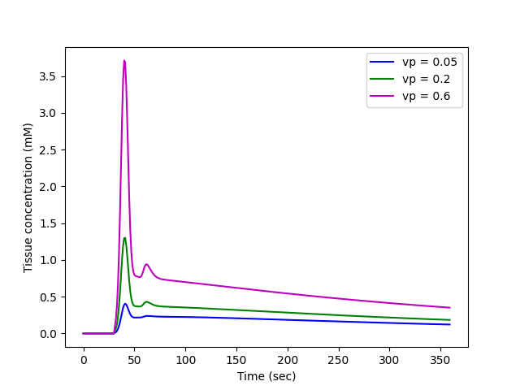
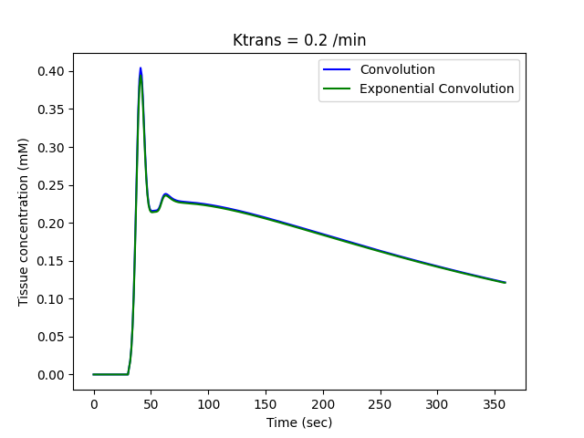

<!--
 DO NOT EDIT.
 THIS FILE WAS AUTOMATICALLY GENERATED BY mkdocs-gallery.
 TO MAKE CHANGES, EDIT THE SOURCE PYTHON FILE:
 "temp_dir/osipi/docs/examples/tissue/plot_extended_tofts.py"
 LINE NUMBERS ARE GIVEN BELOW.
-->

!!! note

    Click [here](#download_links)
    to download the full example code


====================
The Extended Tofts model
====================

Simulating tissue concentrations from extended Tofts model with different settings.

<!-- GENERATED FROM PYTHON SOURCE LINES 8-11 -->

```{.python }

import matplotlib.pyplot as plt

```


<!-- GENERATED FROM PYTHON SOURCE LINES 12-13 -->

Import necessary packages

<!-- GENERATED FROM PYTHON SOURCE LINES 13-16 -->

```{.python }
import numpy as np
import osipi

```


<!-- GENERATED FROM PYTHON SOURCE LINES 17-18 -->

Generate Parker AIF with default settings.

<!-- GENERATED FROM PYTHON SOURCE LINES 18-26 -->

```{.python }

# Define time points in units of seconds - in this case we use a time
# resolution of 1 sec and a total duration of 6 minutes.
t = np.arange(0, 6 * 60, 1)

# Create an AIF with default settings
ca = osipi.aif_parker(t)

```


<!-- GENERATED FROM PYTHON SOURCE LINES 27-29 -->

Plot the tissue concentrations for an extracellular volume fraction
of 0.2 and 3 different plasma volumes of 0.05, 0.2 and 0.6

<!-- GENERATED FROM PYTHON SOURCE LINES 29-43 -->

```{.python }
Ktrans = 0.2  # in units of 1/min
ve = 0.2  # volume fraction between 0 and 1
vp = [0.05, 0.2, 0.6]  # volume fraction between 0 and 1
ct = osipi.extended_tofts(t, ca, Ktrans, ve, vp[0])
plt.plot(t, ct, "b-", label=f"vp = {vp[0]}")
ct = osipi.extended_tofts(t, ca, Ktrans, ve, vp[1])
plt.plot(t, ct, "g-", label=f"vp = {vp[1]}")
ct = osipi.extended_tofts(t, ca, Ktrans, ve, vp[2])
plt.plot(t, ct, "m-", label=f"vp = {vp[2]}")
plt.xlabel("Time (sec)")
plt.ylabel("Tissue concentration (mM)")
plt.legend()
plt.show()

```


{: .mkd-glr-single-img srcset="../images/mkd_glr_plot_extended_tofts_001.png"}

Out:
{: .mkd-glr-script-out }

```{.shell .mkd-glr-script-out-disp }
C:/Users/Rohan Kumar Mahato/Desktop/OSIPI_DOCS/temp_dir/osipi/docs/examples/tissue/plot_extended_tofts.py:41: UserWarning: FigureCanvasAgg is non-interactive, and thus cannot be shown
  plt.show()

```


<!-- GENERATED FROM PYTHON SOURCE LINES 44-46 -->

Comparing different discretization methods for an extracellular
volume fraction of 0.2, Ktrans of 0.2 /min and vp of 0.05

<!-- GENERATED FROM PYTHON SOURCE LINES 46-58 -->

```{.python }
ct = osipi.extended_tofts(t, ca, Ktrans, ve, vp[0])  # Defaults to Convolution
plt.plot(t, ct, "b-", label="Convolution")
ct = osipi.extended_tofts(t, ca, Ktrans, ve, vp[0], discretization_method="exp")
plt.plot(t, ct, "g-", label="Exponential Convolution")
plt.title(f"Ktrans = {Ktrans} /min")
plt.xlabel("Time (sec)")
plt.ylabel("Tissue concentration (mM)")
plt.legend()
plt.show()

# Choose the last image as a thumbnail for the gallery
# sphinx_gallery_thumbnail_number = -1
```


{: .mkd-glr-single-img srcset="../images/mkd_glr_plot_extended_tofts_002.png"}

Out:
{: .mkd-glr-script-out }

```{.shell .mkd-glr-script-out-disp }
C:/Users/Rohan Kumar Mahato/Desktop/OSIPI_DOCS/temp_dir/osipi/docs/examples/tissue/plot_extended_tofts.py:54: UserWarning: FigureCanvasAgg is non-interactive, and thus cannot be shown
  plt.show()

```


**Total running time of the script:** ( 0 minutes  0.318 seconds)

<div id="download_links"></div>


[:fontawesome-solid-download: Download Python source code: plot_extended_tofts.py](./plot_extended_tofts.py){ .md-button .center}

[:fontawesome-solid-download: Download Jupyter notebook: plot_extended_tofts.ipynb](./plot_extended_tofts.ipynb){ .md-button .center}


[Gallery generated by mkdocs-gallery](https://smarie.github.io/mkdocs-gallery){: .mkd-glr-signature }
